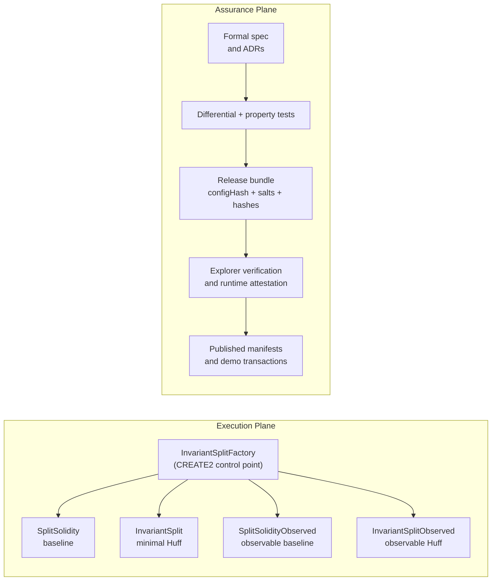
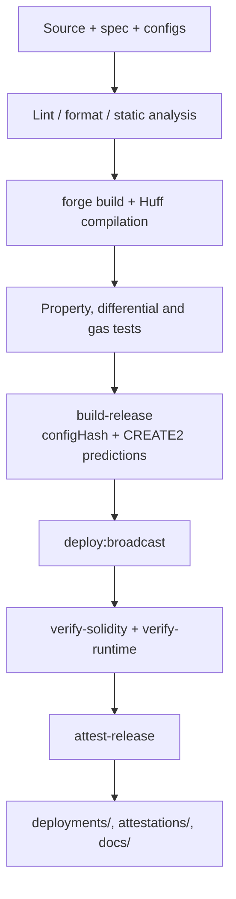

# InvariantSplit

[](https://github.com/doomhammerhell/invariantsplit/actions/workflows/ci.yml)
[](https://github.com/doomhammerhell/invariantsplit/actions/workflows/security.yml)
[](https://github.com/doomhammerhell/invariantsplit/actions/workflows/release.yml)
[](./LICENSE)

Deterministic ETH settlement primitive with a minimal execution plane and an attestable assurance plane.

InvariantSplit is an enterprise-grade open-source reference for value distribution under constrained execution. The repository combines a fixed-recipient Huff splitter, Solidity baselines, deterministic `CREATE2` deployment, runtime attestation, signed release manifests, public Sepolia evidence, and reproducible operator tooling.

## Why This Exists

- Keep the execution path narrow: fixed recipients, exact conservation, atomic failure semantics.
- Make deployment deterministic: predictable addresses, stable `configHash`, repeatable manifests.
- Publish evidence instead of claims: explorer verification for Solidity, runtime attestation for Huff, signed release bundles, and replayable demo transactions.
- Treat the repository as a long-lived system asset, not a one-off contract demo.

## System Architecture



## Delivery Pipeline



## Repository Layout

```text
.
|-- src/                     # Solidity and Huff execution artifacts
|-- tests/                   # Foundry correctness, differential and property suites
|-- scripts/                 # Build, deploy, verification and attestation tooling
|-- docs/                    # Architecture, ADRs, runbooks, articles and Pages entrypoint
|-- spec/                    # Formal invariants and non-goals
|-- deployments/             # Published manifests by chain and configHash
|-- attestations/            # Signed release attestations
|-- .github/                 # CI/CD, templates, Dependabot and governance metadata
|-- Dockerfile               # Multi-stage container for CI and reproducible local runs
`-- .devcontainer/           # VS Code / Codespaces one-click environment
```

## Core Guarantees

- `a + b + c == msg.value`
- exact weights of `50% / 30% / 20%`
- deterministic dust assignment to recipient `C`
- atomic revert if any transfer fails
- no storage mutation in the Huff execution path
- deterministic deployment metadata keyed by `configHash`

## Quick Start

### Local

```bash
npm install
npm run lint
npm run build
npm test
```

### Container

```bash
docker build -t invariantsplit .
docker run --rm -it invariantsplit npm test
```

### Codespaces / VS Code

Open the repository in a Dev Container. The project ships a preconfigured [`.devcontainer/devcontainer.json`](./.devcontainer/devcontainer.json) that installs Node.js, Foundry, lint tooling and recommended editor extensions.

## Key Commands

```bash
npm run lint
npm run build
npm test
npm run benchmark
npm run bytecode:report
npm run build:release -- --profile observed --factory 0x8f9633c55d6EC8EF0426742460A4B374481D6c0C
npm run deploy:simulate
npm run deploy:broadcast
npm run verify:runtime
npm run attest:release
npm run demo:transactions
```

## Production and Demo Evidence

Current public Sepolia observed deployment:

- Factory: [0x8f9633c55d6EC8EF0426742460A4B374481D6c0C](https://sepolia.etherscan.io/address/0x8f9633c55d6EC8EF0426742460A4B374481D6c0C)
- SolidityObserved: [0xc5068CA8448E5FAEd512eA4F734eE6f5b1b08f71](https://sepolia.etherscan.io/address/0xc5068CA8448E5FAEd512eA4F734eE6f5b1b08f71)
- HuffObserved: [0x43A2F08D802642BD30EbaDa4A509d5bbBCa0d2fC](https://sepolia.etherscan.io/address/0x43A2F08D802642BD30EbaDa4A509d5bbBCa0d2fC)
- Deployment manifest: [deployments/latest.json](./deployments/latest.json)
- Human-readable manifest: [deployments/latest.md](./deployments/latest.md)
- Release attestation: [attestations/11155111/0x94c46e9fd4f6c48f12c1a9fcf091eaec30571d94382890e37b9ac2d9b46c4f32.json](./attestations/11155111/0x94c46e9fd4f6c48f12c1a9fcf091eaec30571d94382890e37b9ac2d9b46c4f32.json)
- Demo transactions: [docs/demo-transactions.md](./docs/demo-transactions.md)

## Documentation

- [Documentation index](./docs/index.md)
- [Formal invariants](./spec/invariants.md)
- [Threat model](./docs/threat-model.md)
- [Failure model](./docs/failure-model.md)
- [Release provenance](./docs/release-provenance.md)
- [Claim-to-proof map](./docs/claim-to-proof-map.md)
- [Bytecode analysis](./docs/bytecode-analysis.md)
- [Demo runbook](./docs/demo-runbook.md)
- [Technical article](./docs/articles/invariantsplit-devto.md)
- [DEV Weekend Challenge submission](./docs/articles/dev-weekend-community-submission.md)

## CI/CD and Security

- CI matrix runs lint, build and tests across Ubuntu/macOS and Node.js `22` and `24`.
- Security workflow runs CodeQL, npm audit and contract static analysis gates.
- Dependabot monitors npm and GitHub Actions dependencies.
- Releases are automated with semantic versioning and changelog generation.

## Contributing

Start with [CONTRIBUTING.md](./CONTRIBUTING.md). The repository enforces formatting, linting and conventional commits through EditorConfig, Prettier, ESLint, Solhint, markdownlint, Husky and lint-staged.

## Open-Source Governance

- [License](./LICENSE)
- [Code of Conduct](./CODE_OF_CONDUCT.md)
- [Security Policy](./SECURITY.md)
- [Contributing Guide](./CONTRIBUTING.md)

## Non-Goals

- upgradeability
- generic routing logic
- dynamic weights or recipient management
- governance/admin control paths in the execution plane

The project is intentionally narrow. The control plane grows in rigor; the execution plane stays small.
