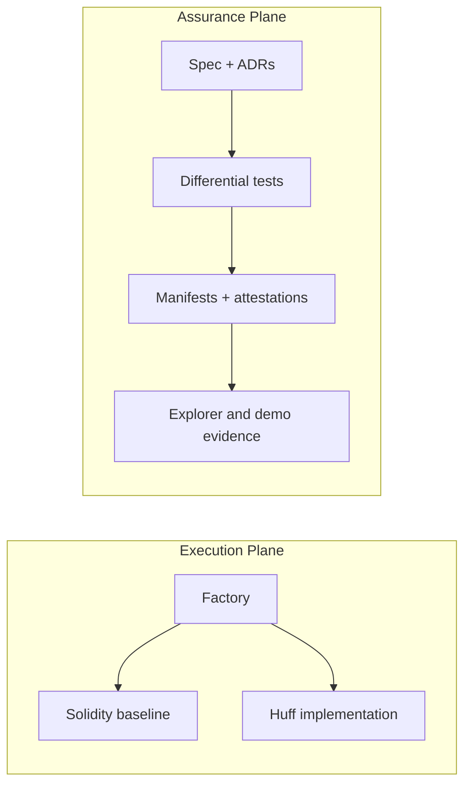

Minimal execution plane. Strong assurance plane.

InvariantSplit is a deterministic ETH settlement primitive with a fixed-recipient Huff implementation, Solidity baselines, deterministic `CREATE2` deployment, runtime attestation, signed release manifests and public Sepolia evidence.

## Read This First

- [Repository README](../README.md)
- [Formal invariants](../spec/invariants.md)
- [Threat model](./threat-model.md)
- [Failure model](./failure-model.md)
- [Release provenance](./release-provenance.md)
- [Claim-to-proof map](./claim-to-proof-map.md)
- [Bytecode analysis](./bytecode-analysis.md)
- [Demo runbook](./demo-runbook.md)

## Architecture

## Public Evidence

- [Current manifest](../deployments/latest.json)
- [Current attestation](../attestations/11155111/0x94c46e9fd4f6c48f12c1a9fcf091eaec30571d94382890e37b9ac2d9b46c4f32.json)
- [Current demo transactions](./demo-transactions.md)
